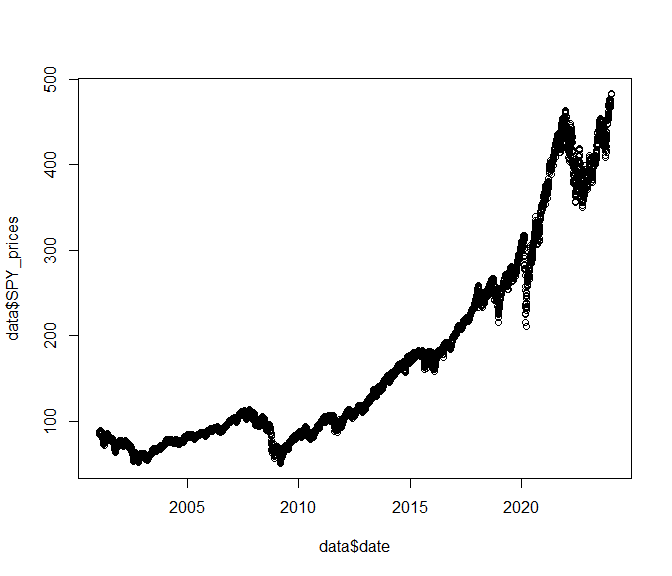
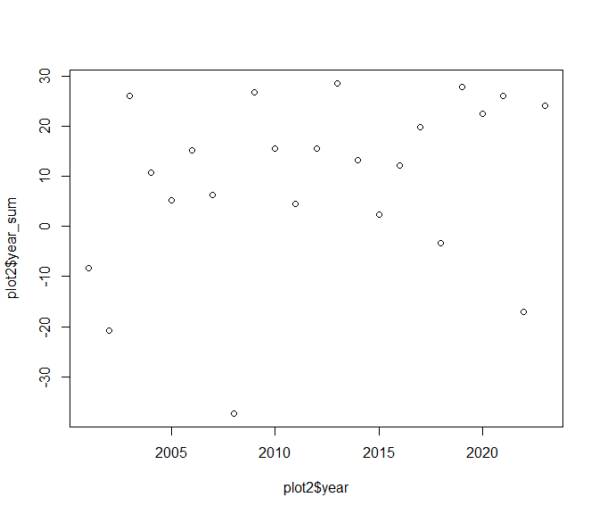
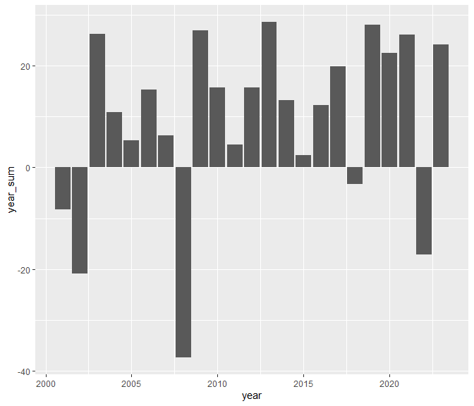

Week 2 workshop
================
Kai Lin A0240090W
2024-01-24

``` r
library(tidyverse)
library(lubridate)
```

``` r
data = readRDS("../data/wk2_stocks.rds")
```

``` r
cumu_returns = sum(data$SPY_returns)

avg_return = mean(data$SPY_returns)

sd_returns = sd(data$SPY_returns)
```

The cumulative returns of the S&P index during this period is 218.33%.

The average daily returns of the S&P index during this period is 0.04%.

The standard deviation of the daily returns of the S&P index during this
period is 1.22%.

``` r
plot(data$date, data$SPY_prices)
```

<!-- -->

``` r
ggplot(data, aes(x = date, y = SPY_prices)) +
  geom_line()
```

<!-- -->

``` r
plot2 = data %>% group_by(year = year(date)) %>%
  filter(year<=2023) %>%
  summarise(year_sum = sum(SPY_returns)*100)

plot(plot2$year, plot2$year_sum)
```

<!-- -->

``` r
ggplot(plot2, aes(x = year, y = year_sum)) + 
  geom_col()
```

<!-- -->
